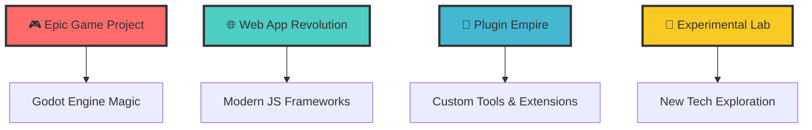

# 🌟 Welcome to the Digital Universe of **Youniss** (aka *yanel*) 🌟

<div align="center">

```ascii
██╗   ██╗ █████╗ ███╗   ██╗███████╗██╗     
╚██╗ ██╔╝██╔══██╗████╗  ██║██╔════╝██║     
 ╚████╔╝ ███████║██╔██╗ ██║█████╗  ██║     
  ╚██╔╝  ██╔══██║██║╚██╗██║██╔══╝  ██║     
   ██║   ██║  ██║██║ ╚████║███████╗███████╗
   ╚═╝   ╚═╝  ╚═╝╚═╝  ╚═══╝╚══════╝╚══════╝
```

### 🔥 *Code Architect • Digital Dreamweaver • Innovation Catalyst* 🔥


</div>

---

## 🚀 **The Legend Begins...**

> *In the ancient lands of Mesopotamia, where civilization first sparked, a new kind of creator emerges...*

**🏺 From the cradle of civilization (Iraq) comes a 22-year-old digital alchemist**  
**🎯 Mission: Transform caffeine into code, dreams into applications**  
**⚡ Superpower: Making computers do impossible things**

---

## 🎭 **Character Stats**

<table align="center">
<tr>
<td align="center" width="200">

**🎮 GAME DEV**
```
Level: 85/100
XP: ████████░░
```
*Master of Virtual Worlds*

</td>
<td align="center" width="200">

**🌐 WEB WIZARD**
```
Level: 90/100
XP: █████████░
```
*HTML Whisperer*

</td>
<td align="center" width="200">

**🔌 PLUGIN SAGE**
```
Level: 80/100
XP: ████████░░
```
*Extension Enchanter*

</td>
</tr>
</table>

---

## 🛡️ **Arsenal of Creation**

### ⚔️ **Primary Weapons**
<div align="center">

| Language | Power Level | Specialty |
|----------|-------------|-----------|
|  | ⭐⭐⭐⭐⭐ | *Enterprise Destroyer* |
|  | ⭐⭐⭐⭐⭐ | *Web Dominator* |
|  | ⭐⭐⭐⭐ | *Backend Beast* |
|  | ⭐⭐⭐⭐⭐ | *Structure Sorcerer* |
|  | ⭐⭐⭐⭐ | *Performance Demon* |
|  | ⭐⭐⭐⭐ | *Unity Conjurer* |
|  | ⭐⭐⭐⭐ | *Godot Guardian* |

</div>

### 🎨 **Legendary Tools**
```yaml
Game_Engine: "Godot Engine 🎮"
Code_Editor: "VS Code ⚡"
Design: "Figma + Photoshop 🎨"
Database: "MySQL + MongoDB 🗄️"
Version_Control: "Git + GitHub 🔀"
Cloud: "AWS + Firebase ☁️"
```

---

## 🌈 **Current Quests**

<div align="center">

### 🏆 **Active Projects**


</div>

---

## 🎪 **The Magic Behind the Code**

<div align="center">

### 🎯 **Youniss's Coding Philosophy**

```javascript
class DigitalCreator {
  constructor() {
    this.name = "Youniss (yanel)";
    this.age = 22;
    this.location = "🇮🇶 Iraq";
    this.passion = "∞";
    this.coffeeLevel = "MAXIMUM";
  }
  
  createMagic() {
    return this.passion + this.creativity + this.code;
  }
  
  dailyRoutine() {
    while(alive) {
      this.drink("coffee");
      this.code("amazing_projects");
      this.learn("new_technologies");
      this.inspire("other_developers");
    }
  }
}

const yanel = new DigitalCreator();
yanel.createMagic(); // 🚀 Pure Innovation
```

</div>

---

## 🎊 **Achievement Unlocked**

<div align="center">

| 🏅 Achievement | 📊 Status | 🎖️ Rarity |
|----------------|-----------|-----------|
| **Code Poet** | ✅ Unlocked | Legendary |
| **Bug Whisperer** | ✅ Unlocked | Epic |
| **Midnight Coder** | ✅ Unlocked | Rare |
| **Coffee Addict** | ✅ Unlocked | Common |
| **Dream Builder** | ✅ Unlocked | Mythical |

</div>

---

## 🌟 **Join the Adventure**

<div align="center">

### 🤝 **Connect with the Legend**

[](https://github.com/IYanel-DEV)
[](#)
[](#)
[](#)

### 🎭 **What Awaits You Here**
- 🎮 **Epic Games** that will blow your mind
- 🌐 **Web Apps** that redefine user experience
- 🔌 **Plugins** that make impossible things possible
- 🧪 **Experiments** that push the boundaries of technology

</div>

---

## 🎨 **The Gallery of Wonders**

<div align="center">

### 📊 **GitHub Statistics Spell**


### 🔥 **The Streak of Legends**


</div>

---

## 💫 **Final Words from the Digital Realm**

<div align="center">

### 🎪 **The Philosophy of Code**

> *"In every line of code lies a universe of possibilities.  
> In every bug fixed, a problem solved for humanity.  
> In every project completed, a dream made reality.  
> This is not just programming—this is digital poetry."*
>
> **— Youniss (yanel), Digital Dreamweaver**

---

### 🌟 **The Invitation**

**Ready to embark on this coding adventure?**  
⭐ **Star my repositories** to join the journey  
🍴 **Fork projects** to create your own magic  
🐛 **Report issues** to help improve the code  
🤝 **Collaborate** and let's build something incredible together!

---


---


[](https://github.com/IYanel-DEV)

**Last Update:** *The legend continues to evolve...* ⚡

</div>

---

*"Made with ❤️, ☕, and countless hours of passionate coding in Iraq 🇮🇶"*
